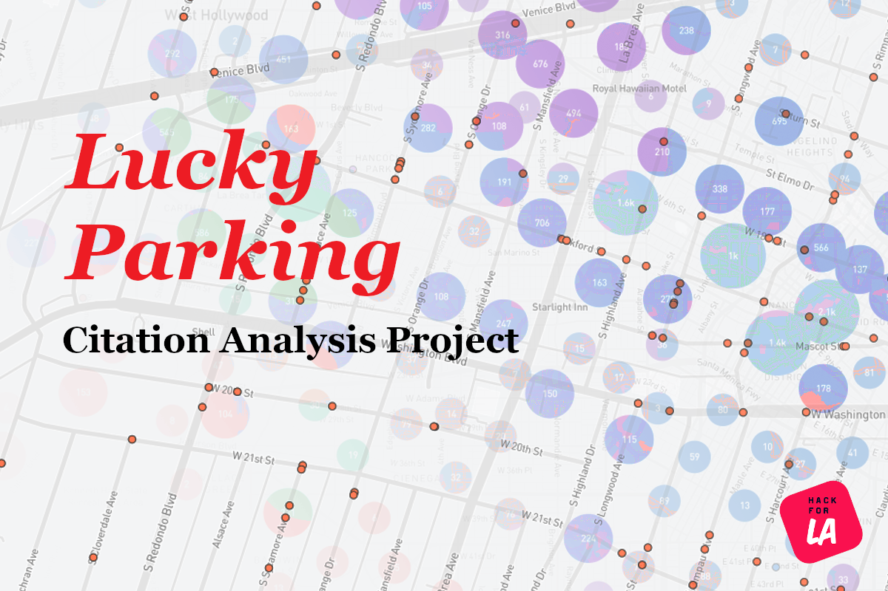

# Lucky Parking



A [Hack for LA](https://www.hackforla.org/) project to help city planners and the community make informed decisions about parking politices in the City of Los Angeles.

The Lucky Parking repository is a [Turborepo](https://turbo.build/repo/docs)-powered monorepo that manages our backend, frontend, shared libraries, and data science workflows.

## Getting Started

### Prerequisites

- Install [Node.js 22](https://nodejs.org/).
- Install [pnpm 9](https://pnpm.io/).
- Fork the repository: https://github.com/hackforla/lucky-parking/fork.
- Clone your fork to your computer for local development.
- Add remote to this repository:

```bash
git remote add upstream git@github.com:hackforla/lucky-parking.git
```

### Install Dependencies

We use `pnpm` as our package manager. To install all dependencies, run:

```bash
pnpm install
```

### Useful Commands

| Command | Description |
|---------|------------|
| `pnpm install` | Install all dependencies |
| `pnpm build` | Build all apps and packages |
| `pnpm dev` | Start all development servers |
| `pnpm test` | Run tests across the monorepo |

## Contributing

Contributions are always welcome!

To get started, follow our organization [onboarding](https://www.hackforla.org/getting-started) steps, and as always, please adhere to [Hack for LA's Code of Conduct](https://github.com/hackforla/codeofconduct).
