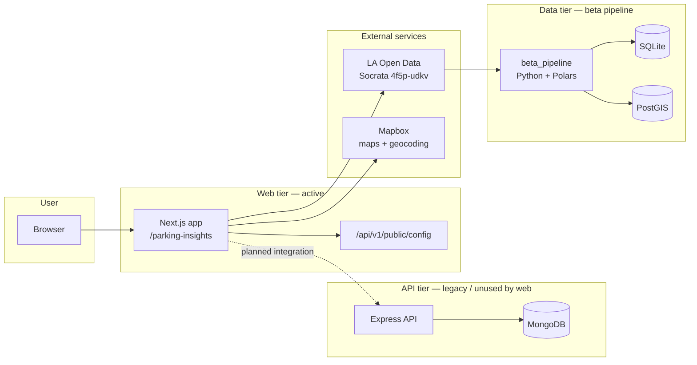
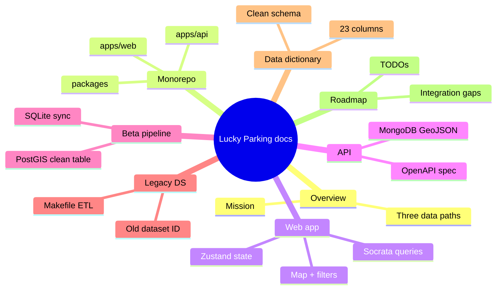

# Overview

## Mission

**Lucky Parking** is a [Hack for LA](https://www.hackforla.org/) project that helps city planners and community members explore Los Angeles parking citation data and make informed decisions about parking policy.

The repository combines:

- A **web map** for interactive exploration of citations by date and geography
- A **data pipeline** for ingesting the city's multi-gigabyte citation export and keeping it fresh via API sync
- A **legacy backend and data-science stack** from earlier project phases

The project is **not complete**. The web app, API, and new data pipeline were built at different times and are not fully integrated. See [Roadmap & open questions](./08-roadmap-and-open-questions.md) for the current gap list.

## Who is this for?

| Audience | Primary entry point |
|----------|---------------------|
| Frontend / full-stack developers | [Web application](./03-web-application.md), [Monorepo structure](./02-monorepo-structure.md) |
| Data / analytics contributors | [Data pipeline](./05-data-pipeline.md), [Data sources & schemas](./07-data-sources-and-schemas.md) |
| API / infra contributors | [Backend API](./04-backend-api.md), [Monorepo structure](./02-monorepo-structure.md) |
| New contributors | This page → [Monorepo structure](./02-monorepo-structure.md) → area of interest |

## System at a glance



## Three parallel data paths

The same underlying citation records can flow through three different paths today:

### 1. Web app → Socrata (live, limited)

The Next.js app queries the [Socrata Query API v3](https://dev.socrata.com/docs/queries/) directly. Users pick a date range and up to two geographic areas; the app fetches matching citations and renders them on a Mapbox map.

**Limitation:** Results are capped at **50 rows** per query (pagination not implemented). See [Web application](./03-web-application.md).

### 2. Beta pipeline → SQLite / PostGIS (local analytics)

The `data-science/beta_pipeline/` Python tools stream the ~6 GB CSV into SQLite or PostGIS using Polars batches. SQLite supports **incremental API sync**; PostGIS supports **spatial queries** and a cleaned analytics table.

**Limitation:** PostGIS does not yet have API sync. The web app does not read from these databases. See [Data pipeline](./05-data-pipeline.md).

### 3. Legacy pipeline → normalized PostGIS (older dataset)

The `data-science/src/data/` scripts and Makefile target an **older dataset ID** (`wjz9-h9np`) and a normalized relational schema (`citation`, `vehicle`, `make`, etc.). This path predates the beta pipeline.

**Limitation:** Dataset ID mismatch with current web app and beta pipeline. See [Legacy data science](./06-legacy-data-science.md).

## Technology summary

| Layer | Stack |
|-------|-------|
| Monorepo | Turborepo, pnpm workspaces |
| Web | Next.js 16, React 19, TypeScript, Tailwind 4, Mapbox GL |
| Shared UI | `@lucky-parking/design` (Radix-based components) |
| API | Express 4, MongoDB driver, Zod validation |
| Beta pipeline | Python 3.12, Polars, psycopg, uv (recommended) |
| Legacy data science | pandas, geopandas, SQLAlchemy, Conda/Makefile |
| Spatial DB | PostGIS 16 (Docker), SQLite (file) |
| CI | GitHub Actions (lint, format, build, test) |

## Primary dataset

All current-facing work uses the LA City Open Data dataset **[Parking Citations (`4f5p-udkv`)](https://data.lacity.org/Transportation/Parking-Citations/4f5p-udkv)** — millions of rows, ~6 GB as CSV, updated on a rolling basis by the city.

Details: [Data sources & schemas](./07-data-sources-and-schemas.md).

## Getting started (short)

**Web app only:**

```bash
pnpm install
cp apps/web/.env.schema apps/web/.env   # add Mapbox + Socrata tokens
cd apps/web && pnpm dev
```

Open `/parking-insights`.

**Data pipeline:**

```bash
cd data-science/beta_pipeline
uv venv --python 3.12 .venv
uv pip install -r requirements.txt jupyter ipykernel --python .venv/bin/python
```

See [Data pipeline](./05-data-pipeline.md) for full workflows.

## Document map


