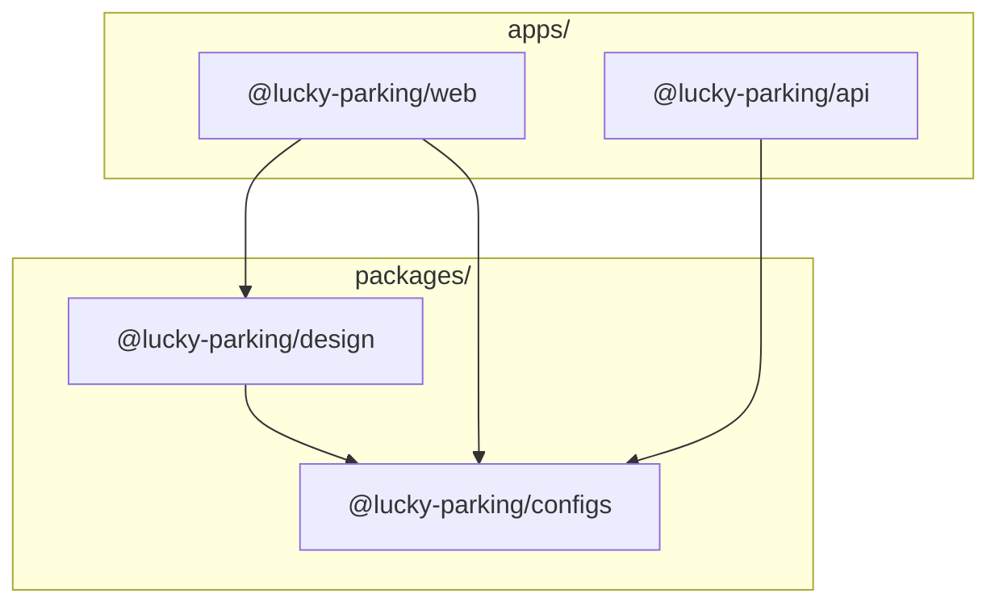
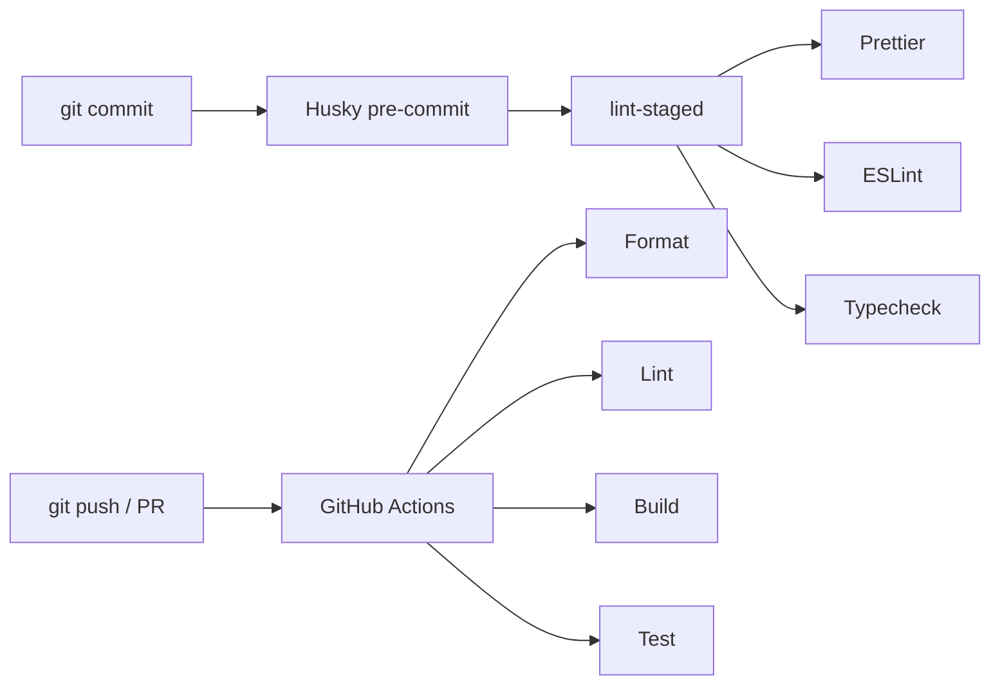
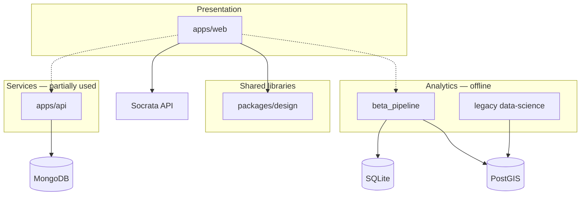

# Monorepo structure

Lucky Parking is a [Turborepo](https://turbo.build/) monorepo managed with **pnpm workspaces**. One install at the root pulls dependencies for all apps and packages.

## Directory layout

```
lucky-parking/
├── apps/
│   ├── web/                 # Next.js frontend (primary user-facing app)
│   └── api/                 # Express REST API (MongoDB)
├── packages/
│   ├── design/              # Shared React UI component library
│   └── configs/             # Shared ESLint, Prettier, TypeScript, Tailwind configs
├── data-science/
│   ├── beta_pipeline/       # Modern Polars + SQLite/PostGIS pipeline
│   ├── src/data/              # Legacy ETL scripts
│   ├── notebooks/             # Jupyter notebooks (exploratory + archived)
│   ├── references/            # Lookup tables (makes, violation codes, regex)
│   ├── db/                    # Legacy PostGIS schema dump
│   └── docker/                # Conda + Jupyter Lab container
├── docs/                      # This documentation set
├── scripts/                   # Shared tooling (e.g. typecheck.mjs)
├── .github/workflows/         # CI (integration, compliance)
├── package.json               # Root scripts via Turbo
├── pnpm-workspace.yaml
└── turbo.json
```

## Workspace packages



| Package | Path | Role |
|---------|------|------|
| `@lucky-parking/web` | `apps/web` | Next.js map application |
| `@lucky-parking/api` | `apps/api` | Express citations API |
| `@lucky-parking/design` | `packages/design` | Buttons, sidebar, calendar, dialog, etc. |
| `@lucky-parking/configs` | `packages/configs` | Shared lint/format/TS/tailwind presets |

## Turbo task pipeline

Root `package.json` delegates to Turbo:

| Command | Effect |
|---------|--------|
| `pnpm install` | Install all workspace dependencies |
| `pnpm dev` | Start dev servers (persistent, uncached) |
| `pnpm build` | Build apps/packages; depends on upstream `^build` |
| `pnpm lint` | ESLint across workspaces |
| `pnpm format` | Prettier |
| `pnpm test` | Test task (limited coverage today) |
| `pnpm check-types` | TypeScript checking |

`turbo.json` defines task dependencies — for example, `build` waits for dependencies' builds and outputs `.next/` or `dist/`.

## Prerequisites

| Tool | Version (as documented) | Used for |
|------|---------------------------|----------|
| Node.js | 22+ (root); API Docker uses 22 | Web, API, tooling |
| pnpm | 9 | Package management |
| Python | 3.10+ (3.12 recommended) | `beta_pipeline` |
| uv | latest | Recommended Python env manager |
| Docker | optional | PostGIS for beta pipeline; legacy Jupyter image |

## Environment files

Each app documents its own env vars via `.env.schema`:

| App / area | Schema file | Key variables |
|------------|-------------|---------------|
| Web | `apps/web/.env.schema` | `MAPBOX_ACCESS_TOKEN`, `SOCRATA_APP_TOKEN` |
| API | `apps/api/.env.schema` | `DB_*`, `API_VERSION`, `COL_NAME_CITATIONS` |
| Beta pipeline | documented in README | `SOCRATA_APP_TOKEN`, `DATABASE_URL` |

**Note:** `.env` files are gitignored. Copy from `.env.schema` and fill in tokens.

**Known issue:** The API code reads `COL_CITATIONS` but the schema documents `COL_NAME_CITATIONS`. See [Backend API](./04-backend-api.md).

## Git hooks and CI



- **Pre-commit:** Husky runs lint-staged (Prettier, ESLint, typecheck on staged files)
- **CI:** `.github/workflows/integration.yaml` — format, lint, build, test on PRs
- **Compliance:** `.github/workflows/compliance.yaml` — PR/issue linking rules

## Running locally

### Web (most common)

```bash
pnpm install
cp apps/web/.env.schema apps/web/.env
# Edit .env with Mapbox and Socrata tokens
cd apps/web && pnpm dev
```

The root route redirects to `/parking-insights` (`apps/web/next.config.ts`).

### API (standalone)

```bash
cd apps/api
# Configure MongoDB connection via .env
pnpm dev   # or see apps/api package.json
```

The web app does **not** call this API today.

### Data pipeline

See [Data pipeline (beta)](./05-data-pipeline.md). Lives outside the Node workspace but shares the repo.

## What is not in the monorepo

| Item | Location / note |
|------|-----------------|
| Citation CSV files | Downloaded locally; gitignored (`raw_data/`, etc.) |
| SQLite DB files | Generated by pipeline; not committed |
| Python `.venv` | Created per contributor; gitignored |
| Production deploy config | Referenced in OpenAPI (`luckyparking.org`) but not fully documented in repo |

## Package boundaries (design intent)



The monorepo currently optimizes for **shared frontend tooling** and **co-located data work**. Full-stack integration (web ↔ API ↔ local DB) remains future work.
