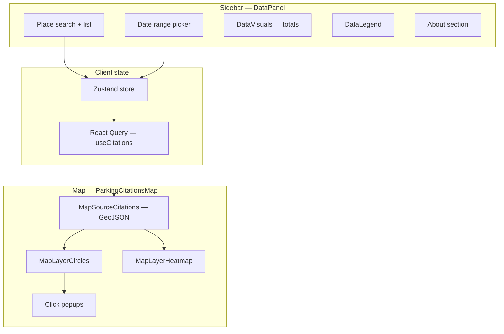
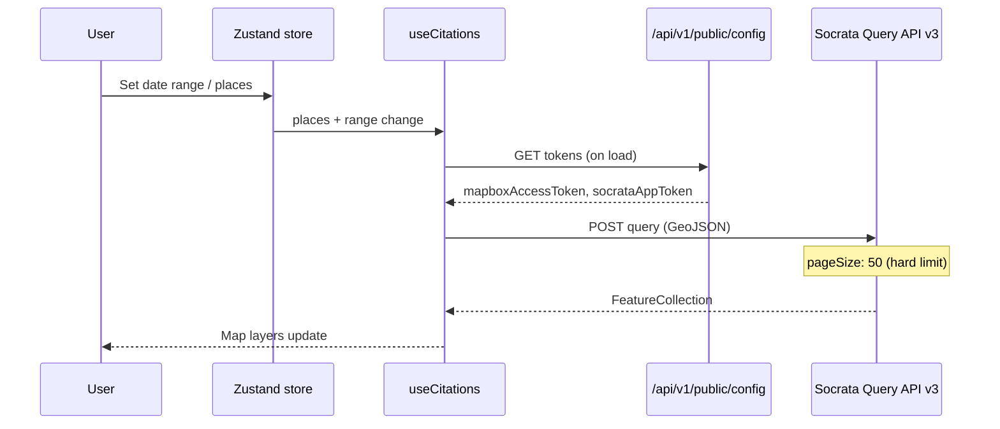
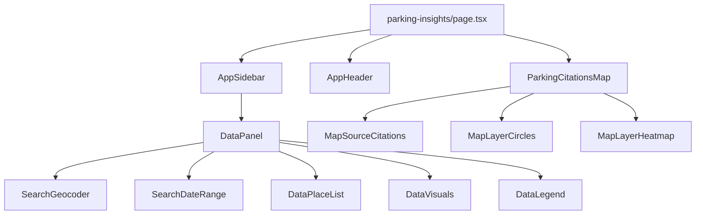
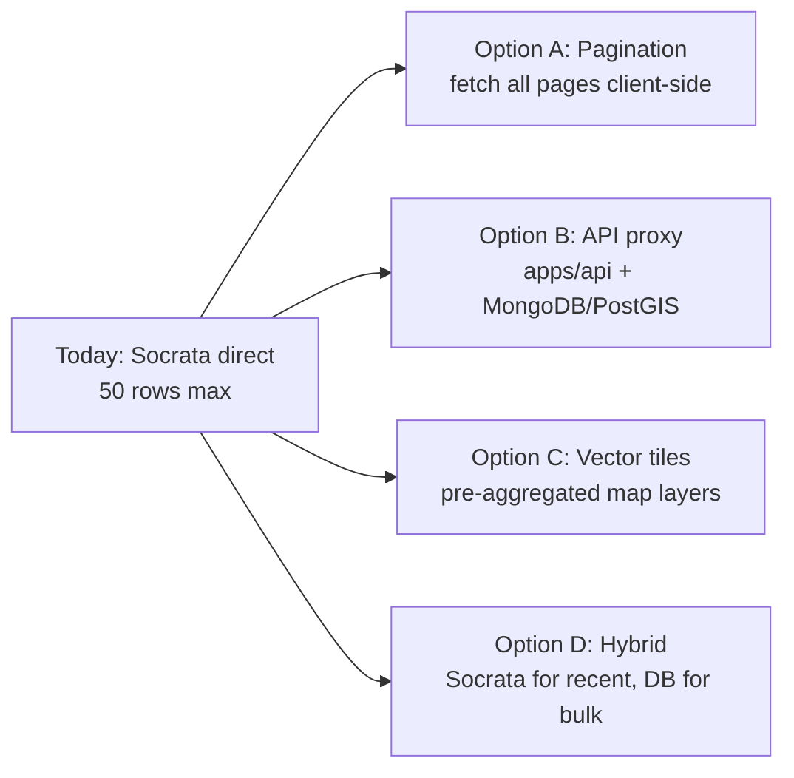

# Web application

The primary user-facing application lives in `apps/web` — a **Next.js 16** app that visualizes LA parking citations on an interactive Mapbox map.

**Route:** `/parking-insights` (root `/` redirects here)

## User experience

Users can:

1. Select a **date range** (default: last 7 days)
2. Search and add up to **two places** (neighborhood councils, addresses via Mapbox geocoding)
3. View citations as **circle markers** and an optional **heatmap** on the map
4. See **aggregate stats** (total citations, total/average fines) in a sidebar panel
5. Click map features for citation detail popups



## Key files

| Path | Purpose |
|------|---------|
| `src/app/parking-insights/page.tsx` | Main page layout (sidebar + map) |
| `src/app/layout.tsx` | Root layout, fonts, global styles |
| `src/app/api/v1/public/config/route.ts` | Serves public tokens to the client |
| `src/store.ts` | Zustand store (query, range, places) |
| `src/hooks/use-citations.tsx` | React Query hook wrapping Socrata fetch |
| `src/hooks/use-geocoder.tsx` | Mapbox + neighborhood council search |
| `src/hooks/use-public-config.ts` | Fetches Mapbox/Socrata tokens |
| `src/lib/socrata/parking-citations.ts` | Builds SoQL query, POSTs to Socrata |
| `src/components/map.tsx` | Map container |
| `src/components/map-source-citations.tsx` | GeoJSON source layer |
| `src/components/data-visuals.tsx` | Citation/fine statistics |
| `src/data/los-angeles*.json` | City/county boundary GeoJSON |

## State management

The app uses **Zustand** with Immer, persist, and devtools middleware (`src/store.ts`).

| State | Type | Default | Persisted? |
|-------|------|---------|------------|
| `query` | string | `""` | No |
| `range` | `{ from, to }` | Last 7 days | Yes (localStorage) |
| `places` | `Map<id, GeocoderResult>` | empty | Yes |
| `isHydrated` | boolean | false | No |

**Constraints:**

- Maximum **2 places** (`MAX_PLACES = 2`)
- Date range normalized to start/end of day via `date-fns`

Persistence key: `luckyparking` in `localStorage`.

## Data fetching flow



### Socrata integration

**Endpoint:** `https://data.lacity.org/api/v3/views/4f5p-udkv/query`

**Query construction** (`parking-citations.ts`):

- Date filter: `issue_date BETWEEN 'YYYY-MM-DD' AND 'YYYY-MM-DD'`
- Optional geo filter: `within_polygon(geocodelocation, 'WKT')` when places are selected
- Combines multiple place geometries into a multipolygon via Turf.js

**Headers:** `Accept: application/vnd.geo+json`, `X-App-Token`

**Validation:** Response parsed with Zod (`ParkingCitationFeatureCollectionSchema`)

### Public config API

`GET /api/v1/public/config` exposes server-side env vars to the browser:

- `MAPBOX_ACCESS_TOKEN`
- `SOCRATA_APP_TOKEN`

The client will not fetch citations unless both a Socrata token and at least one place are present.

## Map layers

| Component | Layer type | Behavior |
|-----------|------------|----------|
| `MapSourceCitations` | GeoJSON source | Driven by `useCitations` data |
| `MapLayerCircles` | Circle layer | Individual citation points |
| `MapLayerHeatmap` | Heatmap layer | Density visualization |
| Base map | Mapbox GL | LA county bounds enforced |

Static boundary data under `src/data/` supports geocoding context and map constraints.

## Component hierarchy



UI primitives come from `@lucky-parking/design` (sidebar, accordion, calendar, button, etc.).

## Environment setup

```bash
cp apps/web/.env.schema apps/web/.env
```

| Variable | Required | Purpose |
|----------|----------|---------|
| `MAPBOX_ACCESS_TOKEN` | Yes | Map tiles and geocoding |
| `SOCRATA_APP_TOKEN` | Yes (for data) | Raises rate limits; required for queries in current logic |

Free tokens: [Mapbox](https://account.mapbox.com/), [LA City Data / Socrata](https://data.lacity.org/login).

## Known limitations (unfinished)

| Issue | Location | Impact |
|-------|----------|--------|
| **50-row pagination cap** | `parking-citations.ts` FIXME | Map shows at most 50 citations per query |
| **No backend API usage** | architecture | Cannot leverage MongoDB-preloaded data |
| **Legend placeholder** | `data-legend.tsx` TODO | Legend may not reflect real violation categories |
| **Geocoder edge cases** | `use-geocoder.tsx` TODO | Address/postcode result types not fully handled |
| **No offline/local DB mode** | — | Pipeline databases not wired to web |

See [Roadmap](./08-roadmap-and-open-questions.md) for planned fixes and integration options.

## Possible future directions



| Direction | Pros | Cons |
|-----------|------|------|
| Client pagination | Smallest change | Slow for large date ranges; rate limits |
| Express API + DB | Full control, fast queries | Requires ingestion + deployment |
| Vector tiles / MVT | Best map performance at scale | New infra pipeline |
| Hybrid recent + historical | Good UX split | Two code paths to maintain |

## Running and building

```bash
cd apps/web
pnpm dev      # development server
pnpm build    # production build
pnpm lint     # ESLint
```

From repo root: `pnpm dev` starts all configured dev tasks via Turbo.
