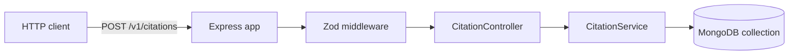
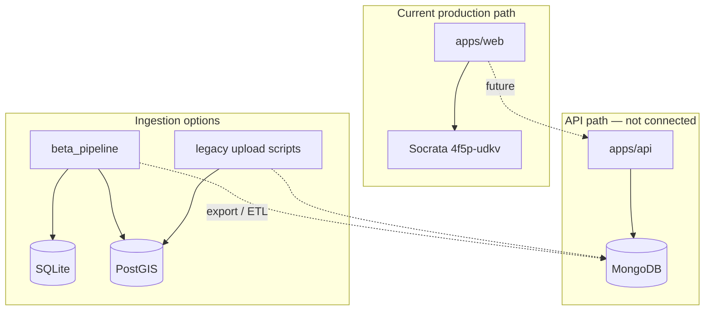

# Backend API

The `apps/api` package is an **Express 4** REST service that queries parking citations from **MongoDB** using geospatial and date filters.

**Important:** The current Next.js web app does **not** use this API. It queries Socrata directly. Treat this service as **legacy / alternate backend** until integration work is done.

## Purpose (intended)

Provide a stable API for filtering citations by:

- **Date range** — `issue_date` between two ISO datetimes
- **Geography** — GeoJSON polygon (`$geoWithin`)

This would allow pre-indexed queries over a full local copy of citations instead of live Socrata calls.

## Architecture



## Routes

| Method | Path | Handler | Description |
|--------|------|---------|-------------|
| GET | `/{API_VERSION}/` | inline | Health/hello |
| POST | `/{API_VERSION}/citations` | `CitationController.listCitations` | Filter citations |

`API_VERSION` defaults from env (see `.env.schema`).

## Request contract

**Body** (validated by `CitationFiltersSchema`):

```json
{
  "dates": ["2025-01-01T00:00:00.000Z", "2025-01-31T23:59:59.999Z"],
  "geometry": {
    "type": "Polygon",
    "coordinates": [[[...]]]
  }
}
```

Both fields are optional. Empty filters return broader result sets (subject to MongoDB query logic).

## MongoDB query logic

`CitationService.findCitations()` (`src/services/citations.ts`):

```javascript
{
  $and: [
    { issue_date: { $gte: dates[0], $lte: dates[1] } },  // if dates provided
    { geometry: { $geoWithin: { $geometry: geometry } } },  // if geometry provided
    { "geometry.coordinates": { $nin: [null] } }
  ]
}
```

Documents are expected to store citation geometry in a GeoJSON-compatible shape.

## OpenAPI specification

Full contract: [`apps/api/src/docs/specs-v1.yaml`](../apps/api/src/docs/specs-v1.yaml)

- Documented server: `https://luckyparking.org/api/v1`
- Response shape: `{ data: CitationFeatureCollection }` (GeoJSON FeatureCollection)
- Includes RFC 7946 GeoJSON schema components

**Stale reference:** External docs link may still point to older dataset `wjz9-h9np` while the web app and beta pipeline use `4f5p-udkv`.

## Environment variables

From `apps/api/.env.schema`:

| Variable | Purpose |
|----------|---------|
| `API_VERSION` | URL prefix (e.g. `v1`) |
| `DB_USERNAME` | MongoDB user |
| `DB_PASSWORD` | MongoDB password |
| `DB_HOST` | MongoDB host |
| `DB_NAME` | Database name |
| `COL_NAME_CITATIONS` | Collection name (documented) |

**Bug:** Runtime code reads `COL_CITATIONS`, not `COL_NAME_CITATIONS`:

```typescript
const { COL_CITATIONS } = process.env;
// ...
db.collection(COL_CITATIONS as string)
```

Contributors must set the variable name the code actually uses, or fix the mismatch.

## Key source files

| File | Role |
|------|------|
| `src/index.ts` | Server entry, MongoDB connect, listen |
| `src/app.ts` | Express app setup, routes, middleware |
| `src/controllers/citations.ts` | HTTP handler |
| `src/services/citations.ts` | MongoDB query |
| `src/database/client.ts` | Mongo client |
| `src/middleware/validator.ts` | Zod request validation |
| `src/utilities/schemas.ts` | Zod schemas (GeoPolygon is `z.any()` — TODO) |

## Relationship to other systems



No automated job today loads `beta_pipeline` output into MongoDB for the API.

## Unfinished / open items

| Item | Status |
|------|--------|
| Web app integration | Not started |
| Env var naming (`COL_CITATIONS`) | Bug / inconsistency |
| Full GeoPolygon Zod schema | TODO in `schemas.ts` |
| Dataset alignment (`4f5p-udkv` vs `wjz9-h9np`) | Needs migration plan |
| Ingestion pipeline → MongoDB | Not implemented in beta_pipeline |
| Automated tests | Minimal / absent at app level |

## Possible directions

1. **Retire the API** — If Socrata + local PostGIS meet all needs, deprecate MongoDB path and document removal.
2. **Revive as BFF** — Express proxies to PostGIS (or SQLite) with the same filter contract as OpenAPI; web app switches from Socrata.
3. **MongoDB as cache** — Scheduled job syncs Socrata or CSV into Mongo for GeoJSON-native `$geoWithin` queries.
4. **Unify on PostGIS** — Single spatial database serves both analytics notebooks and a thin API layer (PostgREST, custom Express, or Next.js route handlers).

Each option trades operational complexity against query performance and data freshness. See [Roadmap](./08-roadmap-and-open-questions.md).

## Running locally

Configure MongoDB connection and collection name, then:

```bash
cd apps/api
pnpm install   # from root is preferred
pnpm dev       # see package.json for exact script
```

Test with `POST /v1/citations` and a JSON body matching the OpenAPI spec.
