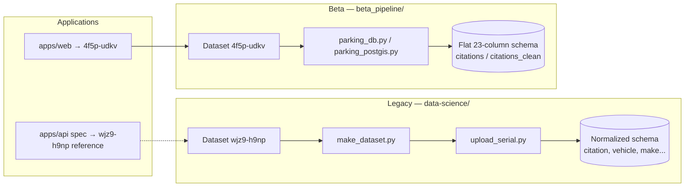
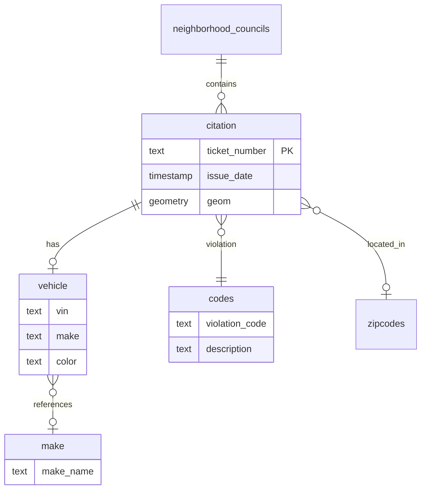

# Legacy data science

Before `beta_pipeline/`, the project used a **Cookiecutter-style data science layout** under `data-science/` with Makefile-driven ETL, normalized PostGIS schemas, and extensive Jupyter notebooks.

This stack is **still in the repo** but is largely **superseded** by the beta pipeline for new work. It targets a **different Socrata dataset ID** and a different database schema.

## Legacy vs beta pipeline



| Aspect | Legacy | Beta pipeline |
|--------|--------|---------------|
| Dataset ID | `wjz9-h9np` | `4f5p-udkv` |
| Primary tool | pandas / geopandas | Polars |
| DB schema | Normalized relational | Flat citation table + clean layer |
| API sync | Via older scripts / manual | SQLite `sync` command |
| Recommended for new work? | No | **Yes** |

## Directory layout

```
data-science/
├── src/data/           # ETL scripts (click/Makefile driven)
├── notebooks/
│   ├── exploratory/    # Active exploration notebooks
│   └── archived_notebooks/  # Older ML, viz, upload experiments
├── references/         # Lookup tables and regex rules
├── db/                 # db_dev.sql — legacy schema dump
├── docker/             # Conda + Jupyter Lab image
├── old_docker/         # Deprecated Dockerfiles
├── docs/               # Sphinx documentation (partially stale)
├── Makefile            # Primary automation interface
├── requirements.txt    # Legacy Python deps
└── beta_pipeline/      # Modern pipeline (see separate doc)
```

## Makefile workflow

The Makefile (`data-science/Makefile`) is the main entry point for legacy tasks:

| Target | Action |
|--------|--------|
| `make requirements` | Install Python dependencies |
| `make data` | Run `make_dataset.py` (raw → processed) |
| `make sample` | Create sample datasets |
| `make serial_data` | Build serial-friendly output |
| `make upload_serial` | Upload to PostGIS |
| `make upload_geojson` | Upload GeoJSON via `upload.py` |
| `make upload_zip` | Upload zipcode boundaries |
| `make upload_neighborhood` | Upload neighborhood councils |
| `make lint` | flake8 on `src/` |
| `make clean` / `make clean_data` | Remove caches / data files |

Requires Conda or system Python (`PYTHON_INTERPRETER = python3`).

## Key ETL scripts (`src/data/`)

| Script | Purpose |
|--------|---------|
| `make_dataset.py` | Download/process raw citation CSV |
| `make_dataset_dask.py` | Dask-based variant for large files |
| `make_serial_data.py` | Prepare serial upload format |
| `upload_serial.py` | Load processed data into PostGIS |
| `upload.py` | Upload GeoJSON layers |
| `upload_neighborhood.py` | Neighborhood council boundaries |
| `get_zipcodes.py` | Zipcode boundary data |
| `sample.py` | Generate sample subsets |
| `date_threshold.py` | Filter by date threshold |

These scripts expect `.env` with `DB_USER`, `DB_PASSWORD`, `DB_HOST`, `DB_PORT`, `DB_DATABASE`.

## Legacy PostGIS schema

`db/db_dev.sql` defines a **normalized** model:



This differs from beta_pipeline's flat `citations` table with 23 city-export columns.

## Reference data (`references/`)

Lookup and normalization files used by legacy cleaning:

| File | Purpose |
|------|---------|
| `make.csv`, `makes.json`, `top_makes.txt` | Vehicle make normalization |
| `violation_codes.json`, `violation_descriptions.json` | Violation lookup |
| `vio_regex.csv` | Regex rules for violation descriptions |
| `column_names.json` | Output column mapping |
| `top_violation_codes.txt` | Common codes list |

These may be useful for future cleaning logic in `beta_pipeline` or `violation_analysis.ipynb` but are not wired into the beta pipeline today.

## Notebooks

### Exploratory (`notebooks/exploratory/`)

Active-ish exploration notebooks (e.g. `1-gp-explore_raw.ipynb`, `1-fl-analysis.ipynb`).

### Archived (`notebooks/archived_notebooks/`)

Historical work including:

- Google Maps citation visualization
- Random Forest / zip code models
- Reddit data (PRAW)
- Server upload experiments
- Regulation sweeping exploration

Treat archived notebooks as **historical context**, not current runbooks.

## Docker (legacy Jupyter)

`data-science/docker/` provides a Conda-based Jupyter Lab image (port **8888**). See `data-science/docker/README.md`.

`old_docker/` contains deprecated Dockerfiles — do not use for new work.

## Sphinx docs

`data-science/docs/` contains Sphinx scaffolding. Some documented commands (e.g. S3 sync) are **not present in the Makefile** — docs may be stale.

## When to use legacy vs beta

| Use case | Recommendation |
|----------|----------------|
| New CSV ingestion for LA citations | **beta_pipeline** |
| Spatial analytics on flat schema | **beta_pipeline** + PostGIS |
| Incremental Socrata sync | **beta_pipeline** SQLite |
| Understanding old ML/viz experiments | Legacy notebooks |
| Normalized vehicle/violation schema | Legacy (or redesign on top of beta) |

## Migration considerations (unfinished)

No automated migration exists between:

- Legacy normalized PostGIS ↔ beta flat PostGIS
- Either database ↔ MongoDB (API)
- Either database ↔ web app

A full migration plan would need to address:

1. **Dataset ID** alignment (`wjz9-h9np` → `4f5p-udkv`)
2. **Schema mapping** (normalized tables vs 23-column flat + clean)
3. **Reference data** port (make/violation normalization into clean step)
4. **Retiring or repointing** legacy Makefile scripts

See [Roadmap](./08-roadmap-and-open-questions.md).

## Possible directions

- **Deprecate legacy ETL** — Archive `src/data/` scripts, keep notebooks for reference only
- **Port normalization into beta clean step** — Use `references/` in `parking_clean.py`
- **Unified Makefile or uv project** — Single Python entry point wrapping beta_pipeline CLI
- **Revive ML notebooks** — Re-run archived models against `citations_clean` in PostGIS
