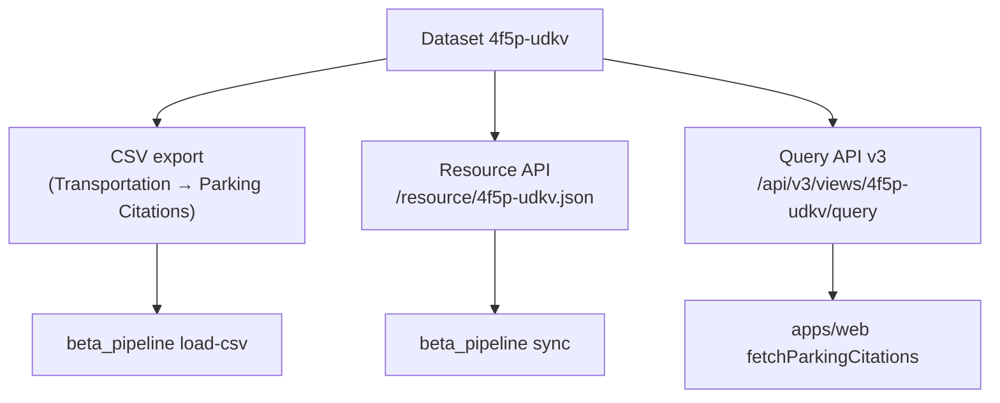
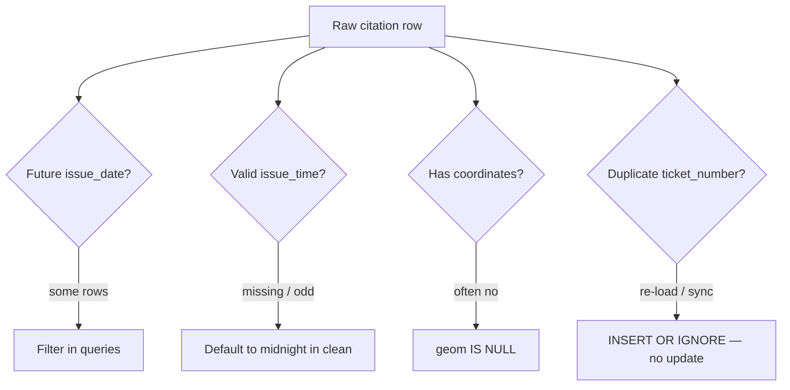

# Data sources and schemas

This document describes where citation data comes from, how it is shaped in each system, and known data quality issues.

## Primary dataset (current)

**[Parking Citations — `4f5p-udkv`](https://data.lacity.org/Transportation/Parking-Citations/4f5p-udkv)**

Published by the City of Los Angeles on the Socrata open data portal.

| Property | Value |
|----------|-------|
| Approximate size | ~6 GB CSV |
| Row count | Millions of citations |
| Update frequency | Rolling updates by city |
| Used by | Web app, beta_pipeline |

### Access methods



| Method | URL pattern | Consumer |
|--------|-------------|----------|
| CSV download | data.lacity.org export | `parking_db.py`, `parking_postgis.py` |
| Resource API | `https://data.lacity.org/resource/4f5p-udkv.json` | `parking_db.py sync` |
| Query API v3 | `https://data.lacity.org/api/v3/views/4f5p-udkv/query` | Next.js web app |

Optional **`X-App-Token`** header improves rate limits (free registration at data.lacity.org).

## Legacy dataset

**[`wjz9-h9np`](https://data.lacity.org/)** — older parking citations dataset referenced by:

- Legacy `make_dataset.py` and related ETL
- OpenAPI external docs in `apps/api` (may be stale)

New work should use **`4f5p-udkv`** unless explicitly migrating historical comparisons.

## Canonical column set (23 fields)

Both SQLite and PostGIS raw tables in `beta_pipeline` store these columns, defined as `COLUMNS` in `parking_db.py`:

| Column | Typical type | Description |
|--------|--------------|-------------|
| `ticket_number` | string | Primary key — unique citation ID |
| `issue_date` | datetime/text | Citation date (CSV: `"2025 Apr 26 12:00:00 AM"`) |
| `issue_time` | string | Time as HHMM without leading zeros (e.g. `"904"`, `"1430"`) |
| `meter_id` | string | Parking meter identifier |
| `marked_time` | string | Marked time field from source |
| `rp_state_plate` | string | Registered plate state |
| `plate_expiry_date` | string | Plate expiration |
| `vin` | string | Vehicle VIN |
| `make` | string | Vehicle make |
| `body_style` | string | Body style code |
| `color` | string | Vehicle color code |
| `location` | string | Street location description |
| `route` | string | Route identifier |
| `agency` | integer | Issuing agency code |
| `violation_code` | string | Violation code |
| `violation_description` | string | Human-readable violation |
| `fine_amount` | float | Fine in dollars |
| `agency_desc` | string | Agency description |
| `color_desc` | string | Color description |
| `body_style_desc` | string | Body style description |
| `loc_lat` | float | Latitude |
| `loc_long` | float | Longitude |
| `geocodelocation` | string | WKT POINT geometry from CSV |

### CSV parsing notes

- Polars schema assigns explicit types per column
- `null_values`: `""`, `"NA"`, `"N/A"`
- `ignore_errors=True` — malformed rows skipped, not fatal
- Batch size default: **100,000 rows**

## PostGIS raw table (`citations`)

All 23 columns plus:

```sql
geom geometry(Point, 4326)
```

**Geometry construction priority:**

1. `ST_GeomFromText(geocodelocation)` when WKT present
2. Else `ST_MakePoint(loc_long, loc_lat)`
3. Else `NULL`

**Indexes:** `issue_date`, `violation_code`, `make`, GiST on `geom`

## PostGIS clean table (`citations_clean`)

Slim analytics schema:

| Column | Type | Notes |
|--------|------|-------|
| `ticket_number` | TEXT PK | |
| `issue_datetime` | TIMESTAMPTZ NOT NULL | Combined date + parsed HHMM time |
| `violation_code` | TEXT | Trimmed |
| `violation_description` | TEXT | Trimmed |
| `fine_amount` | DOUBLE PRECISION | |
| `geom` | geometry(Point, 4326) | Copied from raw |

**Datetime parsing:**

```
issue_date: 2025-04-26T00:00:00.000  (midnight from CSV)
issue_time: "904" → pad → "0904" → 09:04 → 2025-04-26 09:04:00+TZ
```

Missing or non-numeric `issue_time` defaults to midnight on issue date.

## SQLite schema

### `citations`

Same 23 columns, `ticket_number TEXT PRIMARY KEY`, `WITHOUT ROWID`.

### `sync_log`

| Column | Type | Purpose |
|--------|------|---------|
| `id` | INTEGER PK | Auto-increment |
| `started_at` | TEXT | ISO UTC |
| `finished_at` | TEXT | ISO UTC |
| `source` | TEXT | `'csv'` or `'api'` |
| `rows_inserted` | INTEGER | Rows processed |
| `notes` | TEXT | e.g. `'caught_up'` |

## API record shape (Socrata sync)

Socrata returns GeoJSON for location; SQLite sync converts to WKT for `geocodelocation` consistency with CSV rows.

Coerced fields: `agency`, `fine_amount`, `loc_lat`, `loc_long`.

## MongoDB documents (legacy API)

Expected shape (GeoJSON-centric, per OpenAPI):

- `issue_date` — filterable datetime
- `geometry` — GeoJSON Point or similar for `$geoWithin`

Exact document schema is not fully documented in repo — inferred from `CitationService` query logic.

## Auxiliary / boundary data

| Data | Location | Used for |
|------|----------|----------|
| LA city boundary | `apps/web/src/data/los-angeles.json` | Map constraints |
| LA county boundary | `apps/web/src/data/los-angeles-county.json` | Map bounds |
| Neighborhood councils | Referenced in geocoder hook | Place search |
| Mock citations / geocoder | `mock-*.json` | Development / testing |
| Make / violation lookups | `data-science/references/` | Legacy normalization |
| Zipcodes | Legacy upload scripts | Spatial joins |

## Data quality quirks



| Quirk | Detail | Mitigation |
|-------|--------|------------|
| Future dates | Some `issue_date` values years ahead | Filter in analysis queries |
| `issue_time` format | HHMM, no leading zeros; `"0"` → midnight | Handled in clean rebuild |
| Missing geometry | Not all rows geocoded | `WHERE geom IS NOT NULL` for maps |
| API vs CSV location | GeoJSON vs WKT | Normalized on API ingest |
| No ticket updates | `INSERT OR IGNORE` | Switch to upsert if corrections needed |
| Web app row cap | 50 rows per Socrata query | Pagination or DB backend |

## Example queries

**PostGIS — recent geocoded citations:**

```sql
SELECT ticket_number, issue_datetime, violation_description, ST_AsText(geom)
FROM citations_clean
WHERE geom IS NOT NULL
ORDER BY issue_datetime DESC
LIMIT 10;
```

**SQLite + Polars:**

```python
import sqlite3, polars as pl

with sqlite3.connect("parking_citations.db") as conn:
    df = pl.read_database("""
        SELECT violation_description, COUNT(*) AS n,
               ROUND(AVG(fine_amount), 2) AS avg_fine
        FROM citations
        WHERE violation_description IS NOT NULL
        GROUP BY violation_description
        ORDER BY n DESC
        LIMIT 15
    """, connection=conn)
```

## File artifacts (not in git)

| Artifact | Typical path | Created by |
|----------|--------------|------------|
| Citation CSV | `Parking_Citations_*.csv` | Manual download |
| SQLite DB | `parking_citations.db` | `parking_db.py` |
| PostGIS volume | Docker `postgis_data` | `docker compose` |
| Raw data dir | `raw_data/` (gitignored) | Various |
