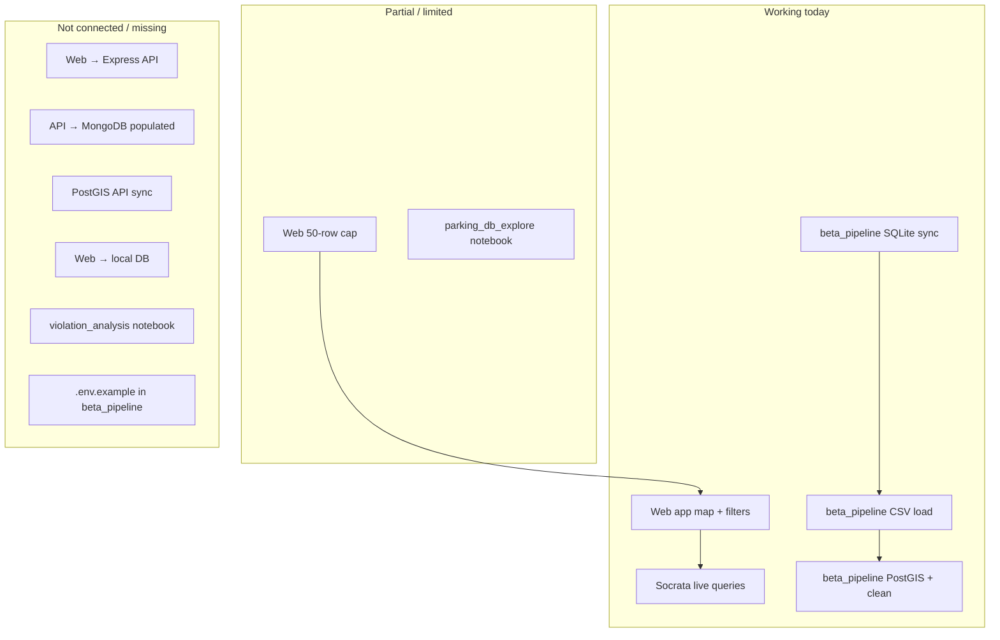
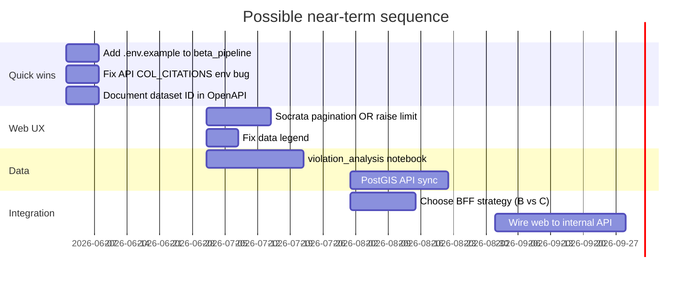

# Roadmap and open questions

Lucky Parking is an active Hack for LA project with **multiple partially overlapping systems**. This page catalogs what is unfinished, known bugs, and reasonable directions the project could take.

**Status key:** ✅ Done · 🟡 Partial · 🔴 Not started / broken · 📋 Documented but missing

## Integration map (today)

## Unfinished by area

### Web application

| Item | Status | Location | Notes |
|------|--------|----------|-------|
| Socrata pagination | 🔴 | `apps/web/src/lib/socrata/parking-citations.ts:73` | Hard `pageSize: 50`; FIXME comment |
| Map legend accuracy | 🔴 | `apps/web/src/components/data-legend.tsx` | TODO: use real violation categories |
| Geocoder address/postcode handling | 🟡 | `apps/web/src/hooks/use-geocoder.tsx:65` | TODO for some result types |
| Connect to backend API | 🔴 | architecture | Web bypasses `apps/api` entirely |
| Connect to local PostGIS/SQLite | 🔴 | architecture | Pipeline output unused by web |
| Automated tests | 🔴 | `apps/web` | No substantive test suite |

### Backend API

| Item | Status | Location | Notes |
|------|--------|----------|-------|
| Used by frontend | 🔴 | — | Express API is orphaned |
| Env var naming bug | 🔴 | `citations.ts` vs `.env.schema` | Code uses `COL_CITATIONS`, schema says `COL_NAME_CITATIONS` |
| GeoPolygon validation | 🟡 | `apps/api/src/utilities/schemas.ts` | TODO: proper Zod schema (`z.any()` today) |
| Dataset ID alignment | 🔴 | OpenAPI external docs | May reference `wjz9-h9np` vs current `4f5p-udkv` |
| Ingestion into MongoDB | 🔴 | — | No pipeline loads current dataset into API DB |
| Automated tests | 🔴 | `apps/api` | Minimal coverage |

### Beta data pipeline

| Item | Status | Location | Notes |
|------|--------|----------|-------|
| SQLite CSV + API sync | ✅ | `parking_db.py` | Production-ready for local use |
| PostGIS CSV + clean | ✅ | `parking_postgis.py`, `parking_clean.py` | Full pipeline works |
| PostGIS API sync | 🔴 | ARCHITECTURE.md | Copy from SQLite, add geom handling |
| Incremental clean rebuild | 🔴 | `parking_clean.py` | Full TRUNCATE each time |
| Scheduled sync / load | 🔴 | — | No cron/CI automation |
| `.env.example` file | 📋 | README references it | File not in repo |
| `violation_analysis.ipynb` | 🔴 | stub imports only | Analysis not written |
| Web/API consumption | 🔴 | — | Databases are offline analytics only |

### Legacy data science

| Item | Status | Notes |
|------|--------|-------|
| Makefile ETL | 🟡 | Works for old dataset/schema; not maintained for `4f5p-udkv` |
| Sphinx docs | 🟡 | Some commands documented but not in Makefile |
| S3 sync | 📋 | Referenced in docs, not implemented in Makefile |
| Cookiecutter `src/models`, `src/features` | 🔴 | Never added; only `src/data/` exists |
| Archived ML notebooks | 🟡 | Historical; not validated against current data |

### Repository / ops

| Item | Status | Notes |
|------|--------|-------|
| Root `pnpm test` | 🟡 | Task exists; apps lack meaningful tests |
| Branch naming docs | 🟡 | CONTRIBUTING mentions `master`/`dev`; CI may use `main`/`stable` |
| Monorepo Python tooling | 🔴 | Python lives outside pnpm; no unified root Python project |

## Code-tracked TODOs / FIXMEs

| File | Marker | Summary |
|------|--------|---------|
| `parking-citations.ts` | FIXME | Remove 50-row pagination limit |
| `use-geocoder.tsx` | TODO | Handle address and postcode geocoder types |
| `data-legend.tsx` | TODO | Refactor legend to real data |
| `schemas.ts` (API) | TODO | Full GeoPolygon Zod schema |

## Strategic forks (where the project could go)

### Path A — "Live Socrata first" (minimal change)

Improve the current web → Socrata path:

- Implement client-side pagination in `fetchParkingCitations`
- Add loading states and rate-limit handling
- Fix legend and geocoder edge cases

**Best if:** Team lacks infra for hosted DB; citations needed are small (recent + localized).

**Risk:** Socrata rate limits and latency at scale; still no offline analysis parity with pipeline.

### Path B — "PostGIS as source of truth"

Make `beta_pipeline` + PostGIS the backend for everything:

- Add PostGIS API sync
- Expose citations via Next.js route handlers or revived Express API querying PostGIS
- Point web app at internal API instead of Socrata
- Deploy PostGIS (RDS, Supabase, etc.)

**Best if:** Full-city or long date-range queries matter; team can run a database.

**Risk:** Ops cost; need ingestion monitoring and auth for public API.

### Path C — "Revive MongoDB API"

Populate MongoDB from pipeline exports; web switches to existing OpenAPI contract:

- ETL job: PostGIS/SQLite → GeoJSON documents → MongoDB
- Fix env var bug and GeoPolygon schema
- Update dataset to `4f5p-udkv`

**Best if:** Team prefers document store + existing API spec.

**Risk:** Two storage systems (PostGIS for analytics, Mongo for API) unless Mongo becomes sole store.

### Path D — "Analytics focus"

Prioritize data science deliverables over web integration:

- Complete `violation_analysis.ipynb`
- Build scheduled sync + clean jobs
- Publish insights/reports; web remains demo with 50-row cap

**Best if:** Primary stakeholders are researchers/policy analysts, not public map users.

### Path E — "Consolidate and deprecate"

Remove or archive legacy paths to reduce contributor confusion:

- Mark `data-science/src/data/` and Mongo API as deprecated
- Single Python package (`beta_pipeline`) + single dataset ID
- Document one golden path in README

**Best if:** Maintainer bandwidth is limited.

## Suggested near-term priorities

A pragmatic sequence many teams would follow:

*Timeline is illustrative — not a committed project plan.*

## Open questions for the team

1. **Which dataset is canonical going forward?** Assume `4f5p-udkv` unless legacy comparisons require `wjz9-h9np`.
2. **Should the Express API survive?** Or replace with Next.js server routes / PostgREST?
3. **Is 50 rows acceptable temporarily?** Or is pagination/blocking for launch?
4. **Who hosts PostGIS in production?** Docker locally only vs cloud managed service.
5. **Are ticket corrections important?** If yes, move from `INSERT OR IGNORE` to upsert.
6. **Should violation normalization (`references/`) feed into `citations_clean`?**
7. **What is the public deployment target?** OpenAPI references `luckyparking.org` — document actual infra.

## How to update this doc

When closing a gap:

1. Change status in the tables above
2. Remove or resolve corresponding TODO/FIXME in code
3. Link to PR or issue if tracked on GitHub

When adding new scope, append to the strategic forks section with pros/cons so future contributors understand why a path was chosen or rejected.
