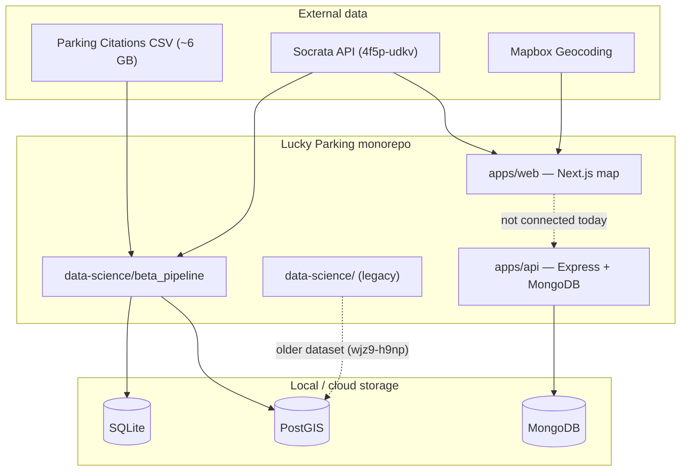

# Lucky Parking


Lucky Parking is a [Hack for LA](https://www.hackforla.org/) project that helps city planners and community members make
informed decisions about parking policies in the City of Los Angeles.

## Repository Structure

The repository manages deployable applications, reusable packages, and project documentation altogether as a pnpm
workspace.

| Path                                                   | Purpose                                        |
| ------------------------------------------------------ | ---------------------------------------------- |
| [`docs/`](.)                                           | Project and contributor documentation          |
| [`apps/`](../apps/)                                    | Deployable applications                        |
| [`apps/web`](../apps/web)                              | [Next.js](https://nextjs.org/) web application |
| [`apps/api`](../apps/api)                              | [Express](https://expressjs.com/) API          |
| [`packages/`](../packages/)                            | Reusable packages for internal consumers       |
| [`packages/design`](../packages/design)                | Shared UI components and styles                |
| [`packages/contracts`](../packages/contracts)          | Shared data contracts                          |
| [`projects/`](../projects/)                            | Project-specific workspaces and tooling        |
| [`projects/data-science/`](../projects/data-science)   | Parking citation analysis                      |

## Getting Started

### Prerequisites

- Install [git](https://git-scm.com/install/) and [mise](https://mise.jdx.dev/installing-mise.html)

### Toolchain

| Tool                            | Responsibility                                  |
| ------------------------------- | ----------------------------------------------- |
| [mise](https://mise.jdx.dev/)   | Executables/runtimes and global developer tools |
| [pnpm](https://pnpm.io/)        | JavaScript dependencies and monorepo workspace  |
| [turbo](https://turborepo.dev/) | Task execution                                  |

If a tool runs against this repository’s source/configuration or is needed after `pnpm install`, it belongs in pnpm. If
it is needed before dependency installation or is language-agnostic/system-level, it belongs in mise.

### Setup

Fork [hackforla/lucky-parking](https://github.com/hackforla/lucky-parking/fork), clone your fork, configure the upstream
remote, and install dependencies:

```bash
git clone https://github.com/YOUR_GITHUB_USERNAME/lucky-parking.git
cd lucky-parking
git remote add upstream https://github.com/hackforla/lucky-parking.git
mise install
pnpm install
```

### Configure environment variables

Create local environment files from the supplied schemas:

```bash
cp apps/web/.env.schema apps/web/.env
cp apps/api/.env.schema apps/api/.env
```

Set the values required by each application:

- `apps/web/.env` needs a [Mapbox](https://www.mapbox.com) access token and a
  [Los Angeles City Data](https://data.lacity.org/login) Socrata app token.
- `apps/api/.env` needs the MongoDB connection and collection values used by the API. Contact the Engineering Lead.

Environment files can contain secrets. Do not commit them.

### Run locally

Start all development tasks from the repository root:

```bash
pnpm dev
```

By default, the web application runs at <http://localhost:3000>, and the API runs at <http://localhost:3001>. Set `PORT`
in the applicable `.env` file to use another port.

To run one application instead, use its workspace package name:

```bash
pnpm --filter @lucky-parking/web dev
pnpm --filter @lucky-parking/api dev
```

## Common commands

Run these from the repository root.

| Command            | Description                                              |
| ------------------ | -------------------------------------------------------- |
| `pnpm install`     | Install workspace dependencies                           |
| `pnpm dev`         | Start development tasks across the workspace             |
| `pnpm build`       | Type-check and build workspace packages and applications |
| `pnpm check-types` | Run TypeScript checks                                    |
| `pnpm lint`        | Lint the repository                                      |
| `pnpm format`      | Check formatting with Prettier                           |
| `pnpm test`        | Run workspace tests                                      |
| `pnpm verify`      | Run type checks, linting, formatting, tests, and builds  |
| `pnpm clean`       | Remove generated workspace artifacts and dependencies    |

## Detailed documentation

| Document | What you'll learn |
|----------|-------------------|
| [Overview](./01-overview.md) | Project mission, high-level architecture, and how the pieces relate |
| [Monorepo structure](./02-monorepo-structure.md) | Turborepo layout, packages, tooling, and local dev workflow |
| [Web application](./03-web-application.md) | Next.js map app, state, Socrata integration, components |
| [Backend API](./04-backend-api.md) | Express/MongoDB API — current status and contract |
| [Data pipeline (beta)](./05-data-pipeline.md) | Polars + SQLite/PostGIS ingestion, CLI, schemas |
| [Legacy data science](./06-legacy-data-science.md) | Older ETL, notebooks, and normalized PostGIS schema |
| [Data sources & schemas](./07-data-sources-and-schemas.md) | Dataset IDs, column dictionary, reference files |
| [Roadmap & open questions](./08-roadmap-and-open-questions.md) | Unfinished work, known gaps, and possible directions |

## Quick reference



## Related docs elsewhere in the repo

- [`data-science/beta_pipeline/README.md`](../data-science/beta_pipeline/README.md) — quick start for the Python pipeline
- [`data-science/beta_pipeline/ARCHITECTURE.md`](../data-science/beta_pipeline/ARCHITECTURE.md) — module-level code reference (complements [05-data-pipeline.md](./05-data-pipeline.md))
- [`apps/api/src/docs/specs-v1.yaml`](../apps/api/src/docs/specs-v1.yaml) — OpenAPI spec for the citations API

## Documentation status

This documentation was written to reflect the repository as of mid-2026. Where behavior is uncertain or in flux, see [Roadmap & open questions](./08-roadmap-and-open-questions.md).

## Contributing

Contributions are welcome. Start with Hack for LA's [onboarding guide](https://www.hackforla.org/getting-started), then
read our team's [contributing guide](CONTRIBUTING.md) and follow the
[Hack for LA Code of Conduct](https://github.com/hackforla/codeofconduct).
